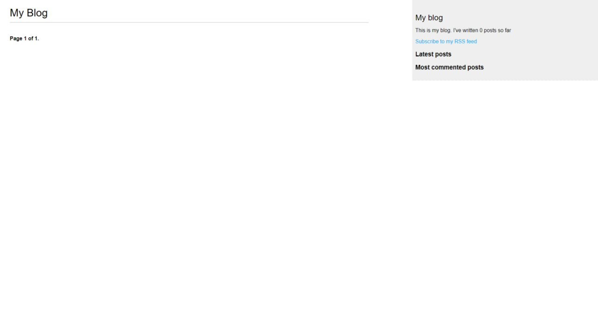
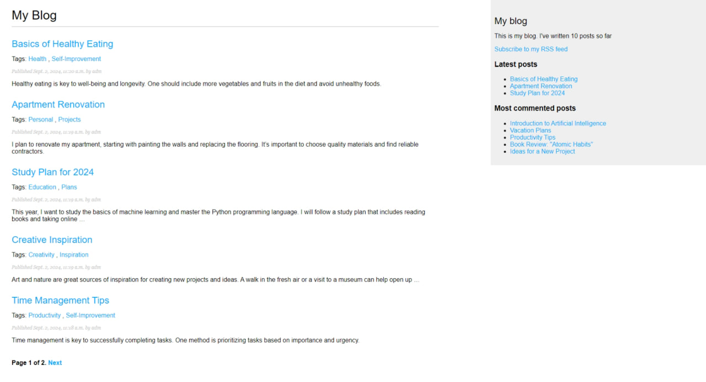
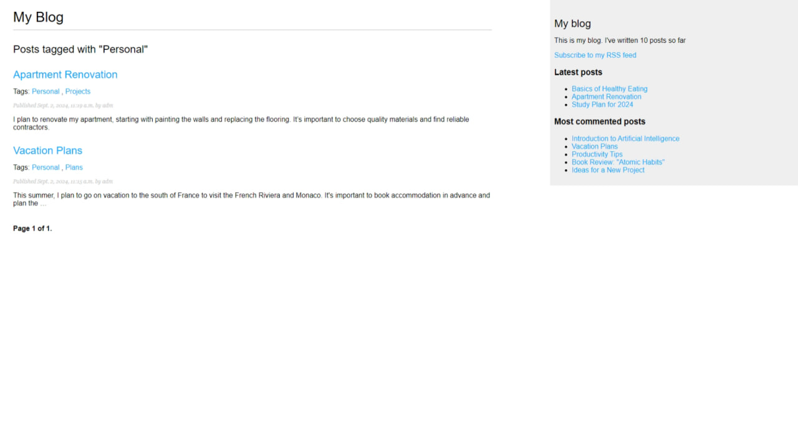
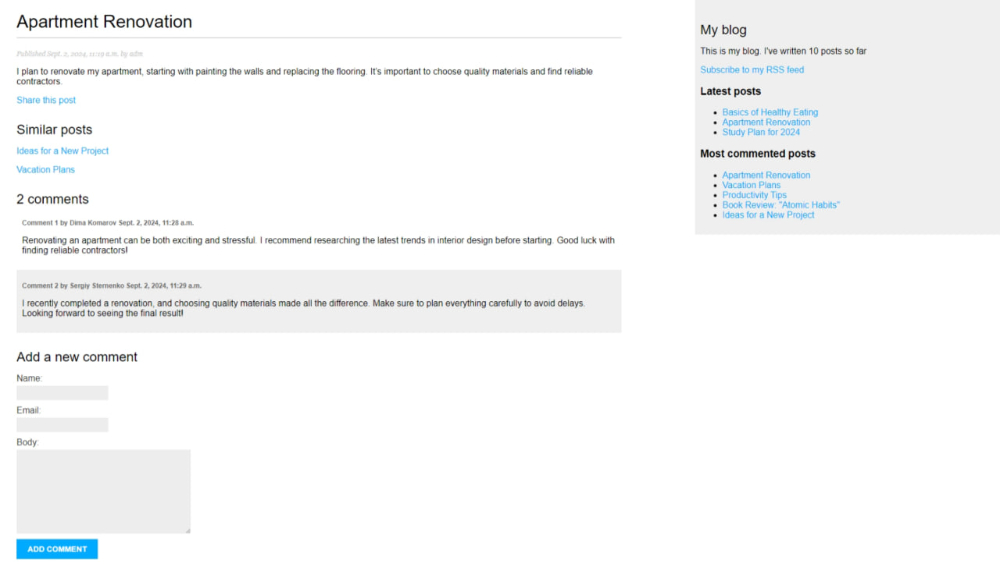
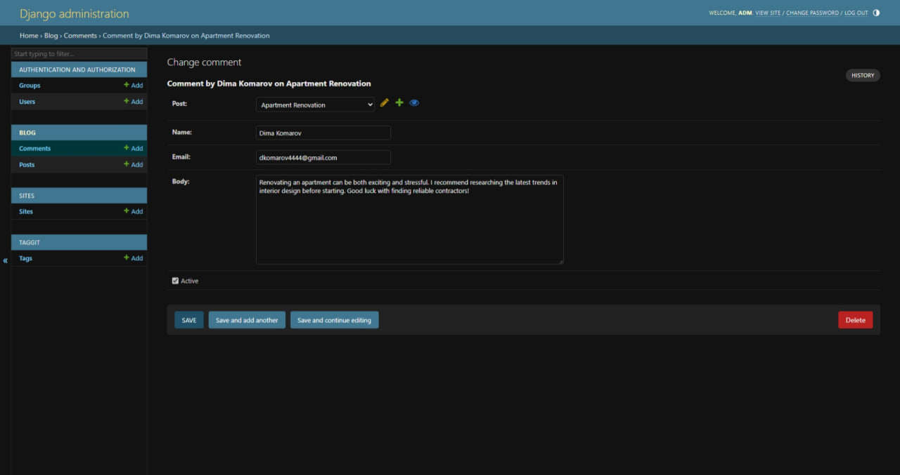
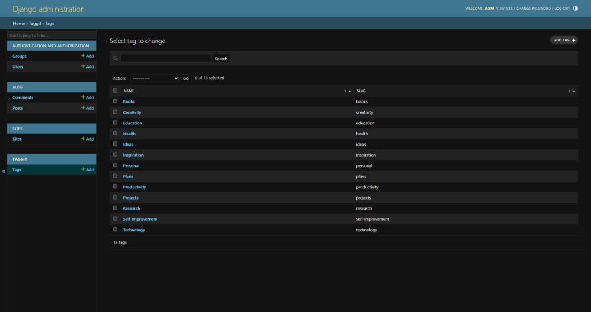

# A Simple Notes Site

## Main page

**The home page where the user can see their notes.**

## Example of a completed notes page

**An example of a populated home page with user notes.**

## Notes sorted by tag

**An example of notes sorted by the tag “Personal”.**

## What an open user note looks like

**On the top left you can see the name of the post, when it was posted and by whom, its content, as well as a button
“share this post”, thanks to which you can share the post by sending a link to it to the e-mail to a certain user.
Below you can see “Similar posts” - posts where identical tags are used.
Then there are comments from users, which they leave in the form below.
Here is an example of what comments look like on behalf of the admin:**

## Tags

**Tags can be created either when creating an entry or directly. They help you sort notes and find similar notes by
interest.**

## Feedback

Please use [telegram](https://t.me/saw_TheMoon) for questions or comments.
