# Application For Storing Notes using Python Django SQL and HTML/CSS/JS

**It is a complete application for storing and sharing your files and records.**

Available functionality:

- Registration/Authorization (including via third-party services like Google)
- Create and store complete records with the ability to attach and store any files
- Full-featured audio/video player. Image preview and the ability to download files back.
- Providing convenient sorting using custom tags/folders
- Section for storing hidden records, where you can get only by knowing the pin entered at registration, with the
  ability to receive it by mail and change it.

## Authorization/Registration page

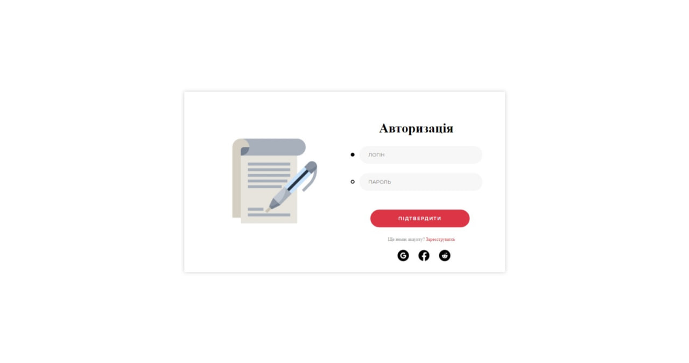
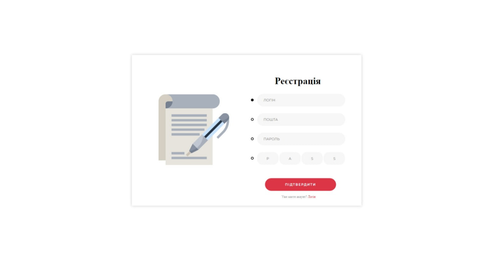

**Page for registration/access to personal records**

## User Workspace

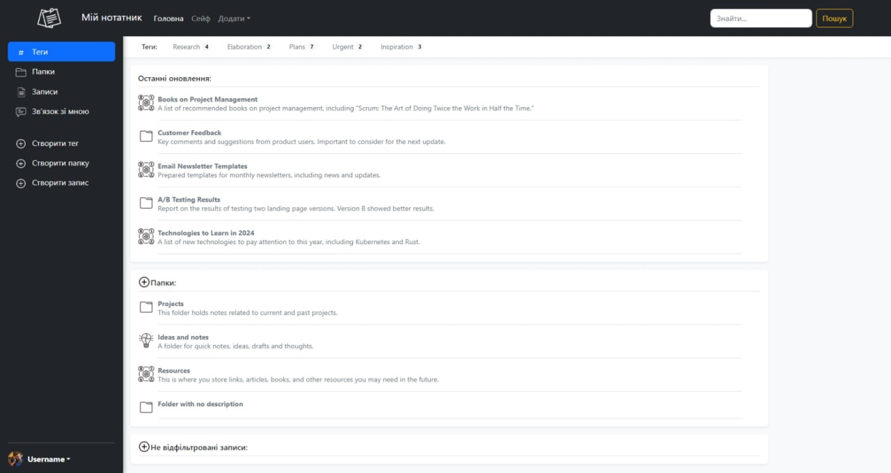

**Home page, where all the main functionality of the user is located:**

- **The sliding panel contains buttons to move the user around the page and the full list of previously created folders
  and records, as well as buttons to create tags/folders/records.**
- **The header, in addition to the link to the main page, contains a button to go to the safe (the place where the
  user's
  archive records are stored), buttons to create tags/folders/records, as well as search for previously created
  folders/records.**
- **The main page contains a list of previously created folders and records with the ability to view their contents.**

## Record Creation Process

**The unfilled record creation template looks like this:**

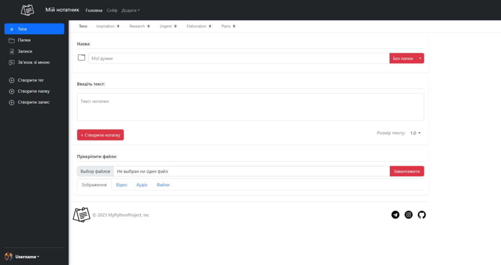

**By clicking on the tags located under the header, the user assigns those to their entry.**
**Below there is a field where you can leave a title, and to the right of it, by clicking on the down arrow, the user
can see the list of folders he created and assign one of them to his entry.**
**Below the field with the title, there is a textarea where the user can leave a note. Since the page uses ajax, when
the
page is refreshed, the text, uploaded files, selected tags and folder will not disappear.**
**Below is the button to save the note and the option to change the font of the textarea, making it smaller/larger
depending on preference.**
**Below the save button is a field for uploading files. The user can upload absolutely any files and they will
automatically be sorted by principle:**

- **Images (including gifs)**
- **Videos**
- **Music and other audio**
- **Everything else**

**The user can interact with each file by viewing/listening to it right when creating a note.**

## Example of a Completed Note

**Img 1**

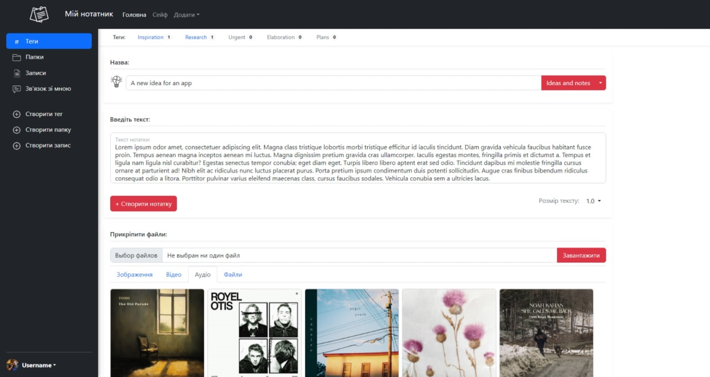

**Img 2**

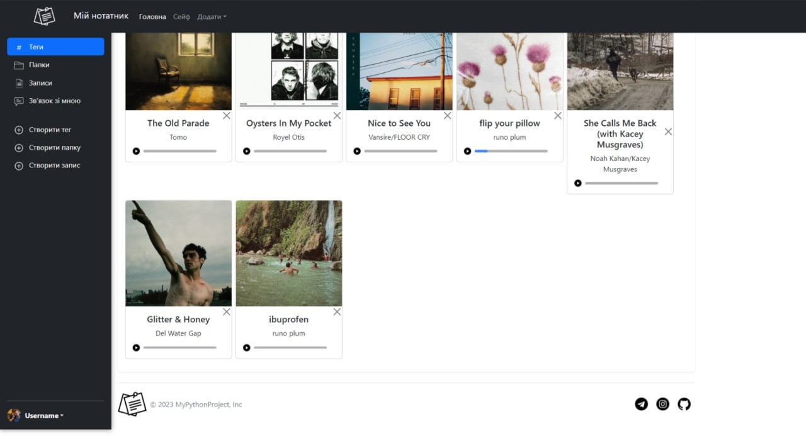

## Tag Creation Example

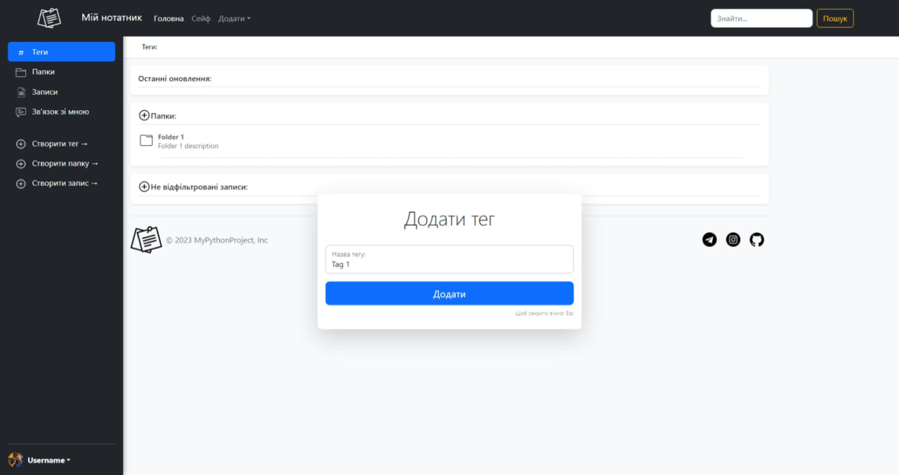

**Window for adding a tag by the user**

## Folder Creation Example

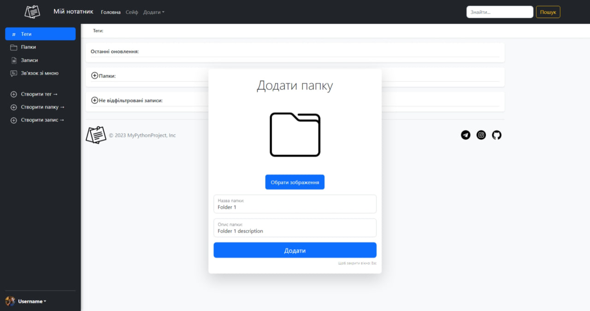

**Window for adding a folder by the user**

## Example Of Sorting Notes Using Tags

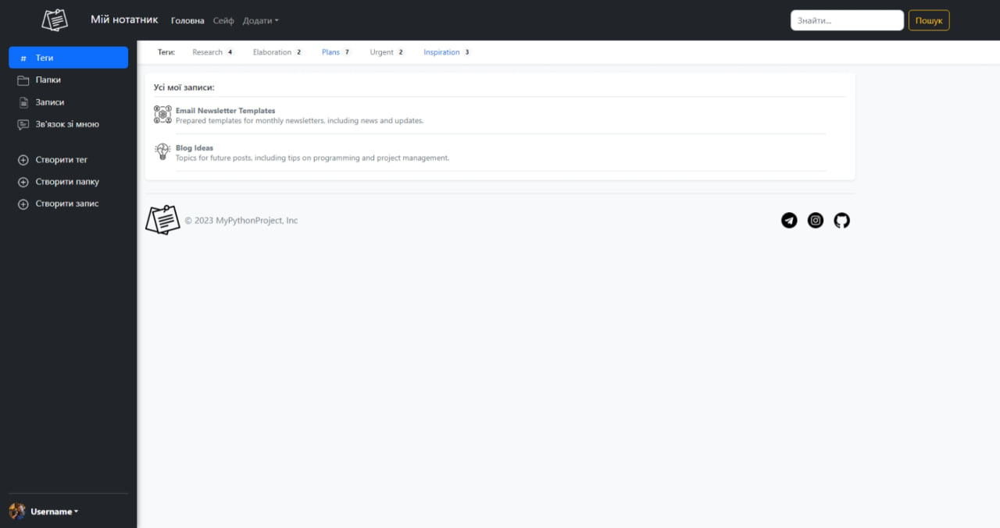

**Going to the list of all records and selecting tags (highlighted in blue), the program shows the user only those to
which this tag was applied. It is also possible to select several tags at once.**

## Reviewing Created Folders and Opening Them

**Img 1**

**Img 2**

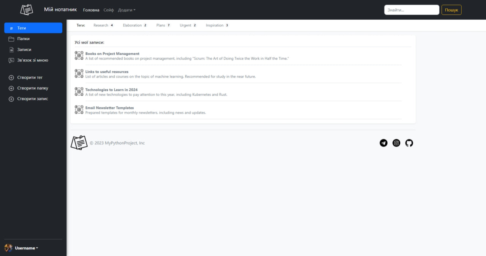

**The user can browse through the folders they have created and open those folders, seeing only certain entries nested
within them.**

## Archive Access

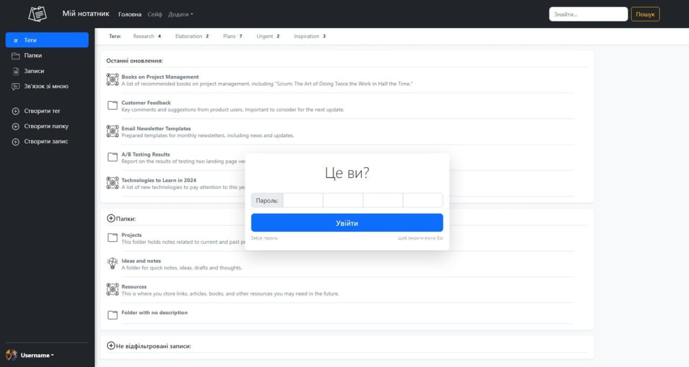

**If necessary to enter the archive, the user will need to enter the pin-code of 4 digits, which the user specified
during registration. In case the password is successfully forgotten ;) there is a button at the bottom that will send a
message to the user's e-mail with further instructions on how to restore it.**

## AND Many More...

## Feedback

Please use [telegram](https://t.me/saw_TheMoon) for questions or comments.
