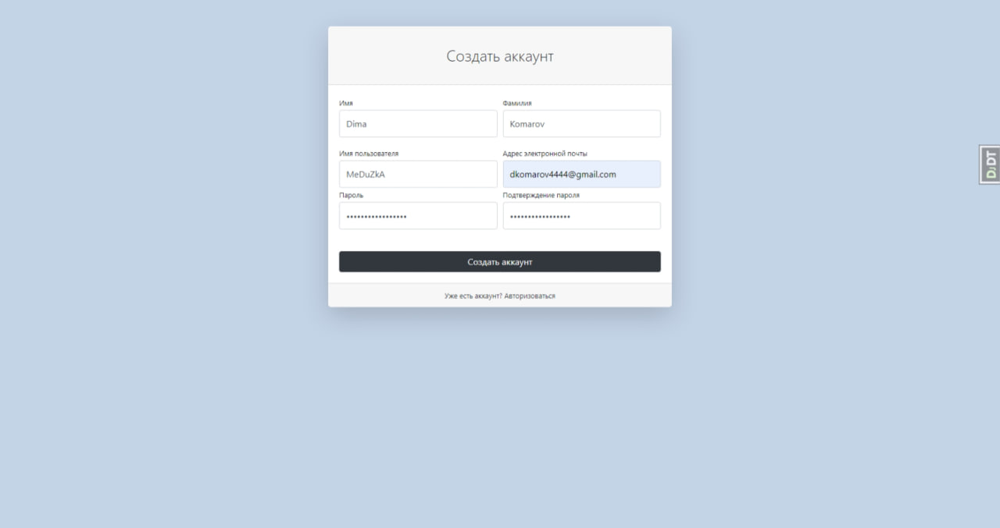
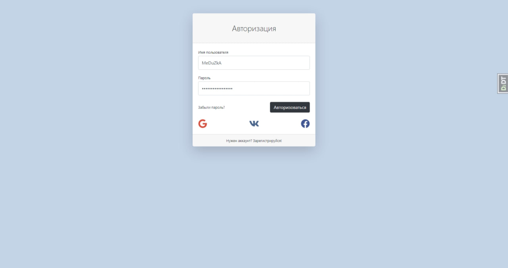
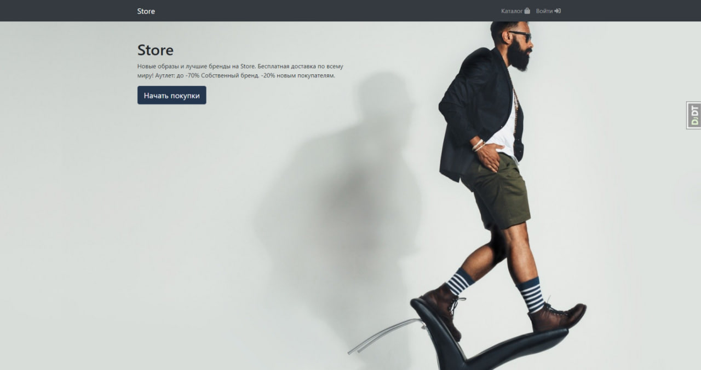
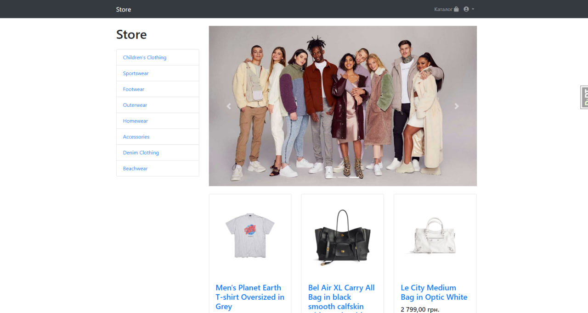
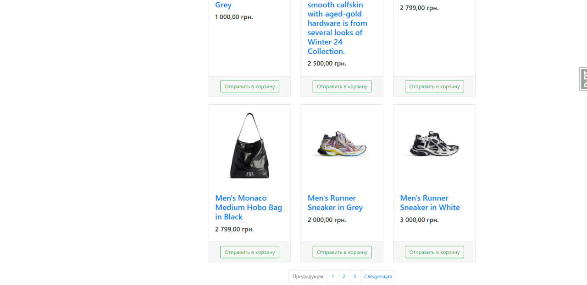
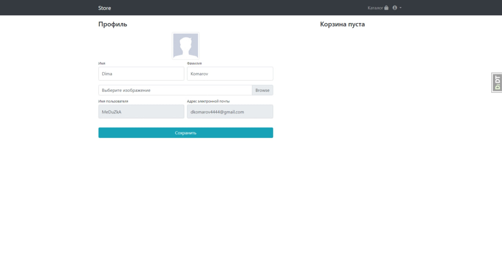
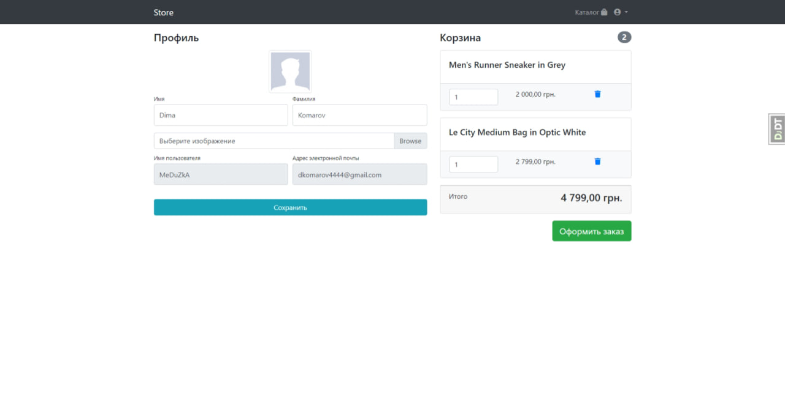
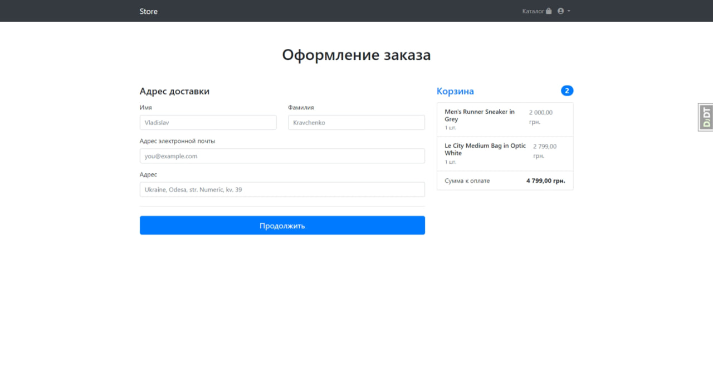
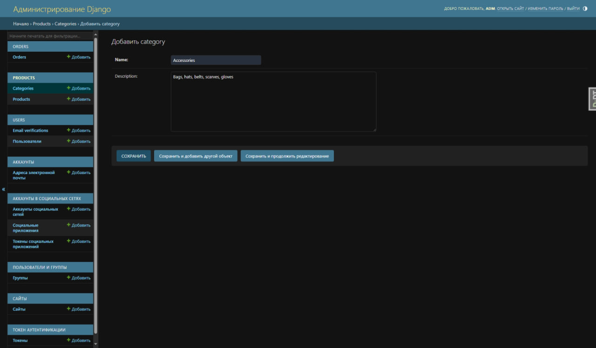
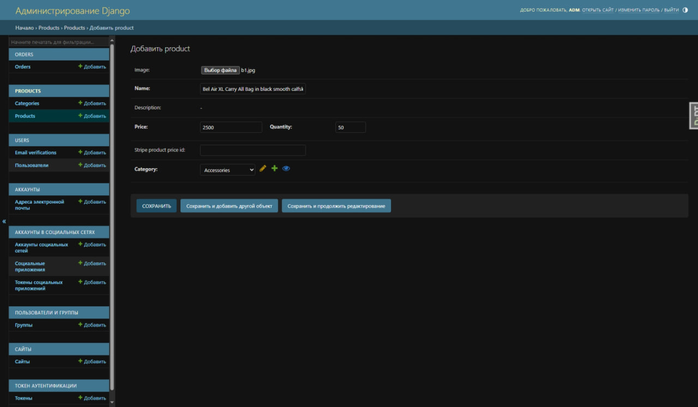

# Store-Site

**It is a full-fledged store app whose main purpose is to sell clothes**

Available pages by User:

- Registration/Authorization (Including via third-party services)
- Home
- Catalog
- Profile
- Order placement using Stripe payment platform

Available pages by Admin:

- View registered accounts
- Creating categories
- Adding products
- Confirmation and processing of paid orders

## Registration/Authorization

**User registration window:**

**User authorization window:**

**Store home page with the ability to redirect to catalog and user profile**

## Home

**Store home page with the ability to redirect to catalog and user profile**

## Catalog

**A product catalog where the user can view available products and add them to the cart. Also on the left side there are
categories, by which the goods are divided, for a more convenient search.**

## User Profile Page

**Here the user can see / change information about themselves. Also, when adding items to cart, those will be shown to
the left of his data:**

## Order

**The order is placed as follows, after which, the user is redirected to the Stripe payment page, where after a
successful transaction, the administrator receives a notification and can confirm the order.**

## Admin

**Добавление каталогов и товаров происходит через django admin следующим образом:**

**Добавление категорий:**

**Добавление товаров:**

## Feedback

Please use [telegram](https://t.me/saw_TheMoon) for questions or comments.
