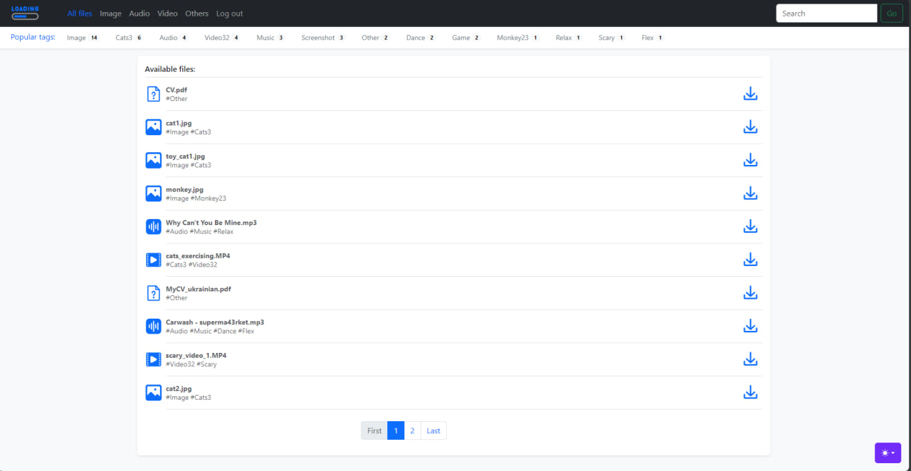
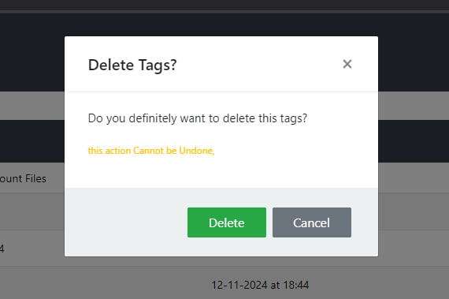

# Application For Storing And Downloading Files using Python FastAPI SQLite and HTML/CSS/JS

**It is a complete application for storing and sharing your files.**

Available functionality:

- Registration/Authorization (including via using session tokens)
- Adding files by administrator and uploading them from authorized users
- Convenient search by name as well as tags assigned to files
- Easy interaction with users, tags and files with the ability to delete, create and edit
- Easy download control: the ability to view your download history, number of downloads and more at any second!

## Registration page

**User Registration Page. It has 3 fields. 2 theme: light and dark. Also set up a lot of checks and in case something
went wrong, the user will be notified:**

## Login page

**The page is similar to registration. Also set up a lot of checks and has 2 themes. If registration is successful, the user receives a session token.**

## Token and access rights

**Upon successful authorization, the user is given a session token, which guarantees that actions
(such as downloading files) will not be performed by third-party users, and therefore - will not load traffic.
In addition to users, there is an administrator role. Unlike a user, he/she has access to the administration panel.
Below are the errors that the user sees in case of unauthorized access to the capabilities of authorized users, administrator:**

## Workspace

**If authorization is successful, the user enters the workspace. Here he can upload any non-hidden files.
If necessary, the files can be sorted by tags, as well as searched using the input on the top right:**

**The number next to the tag name is the number of files associated with it. If necessary, the user can select
several tags.**
**Also on the page there is a working pagination.**

## Admin Panel - Users

**In the users window, the administrator can view active users of the resource, their email, recent activity and the
number of uploaded files. If necessary, it is possible to ban a user (by blocking his email). In this case the
following pop-up window will appear:**

## Admin Panel - Tags

**By clicking on the tags tab the user can see the names of tags, the number of files associated with them, the date of
creation and the number of downloads of files with a particular tag.**

**Creating new tag window.**

**Update tag window.**

**Delete tag window.**

**Also, all admin elements (not only tags) have a search option for more convenient interaction with elements.**

## Admin Panel - File

**The file management panel allows the administrator to manage files. Here he can see file names, the number of
downloads of a particular file, the date it was added, and the file size. By clicking on the blue download button,
the administrator can see the download history of a particular file:**

**Here the administrator can see the name of the file at the time of upload (the name can be changed, but more on that
later), by whom the file was uploaded and the date of upload.**

**The panel of adding a file looks as follows: file upload field, name - is determined automatically (the name of the
uploaded file), but can be changed immediately, tags - the first is assigned automatically - Image, Video, Audio or
Other, it can be removed, as well as add your own tags separated by comma. If the entered tag is absent in the
database, it will be automatically created and assigned to this file, status - if Active - visible to users,
Hidden - hidden.**

**Update file window.**

**Delete file window.**

## Feedback

Please use [telegram](https://t.me/saw_TheMoon) for questions or comments :)
Thanks for your attention!!!
