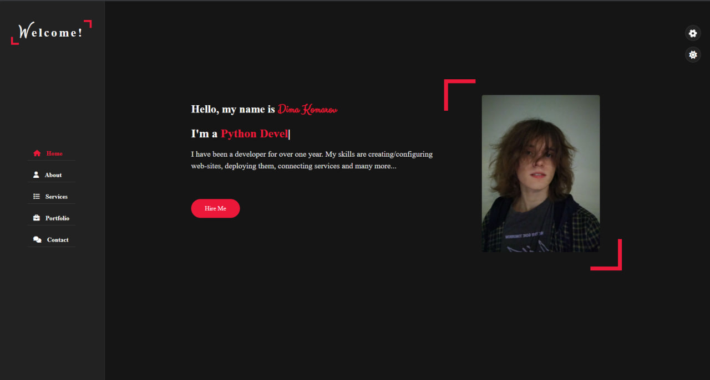
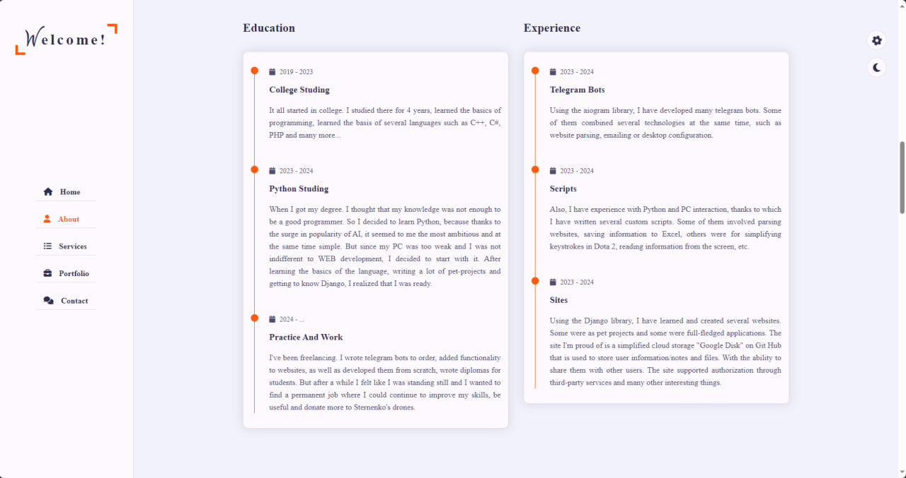
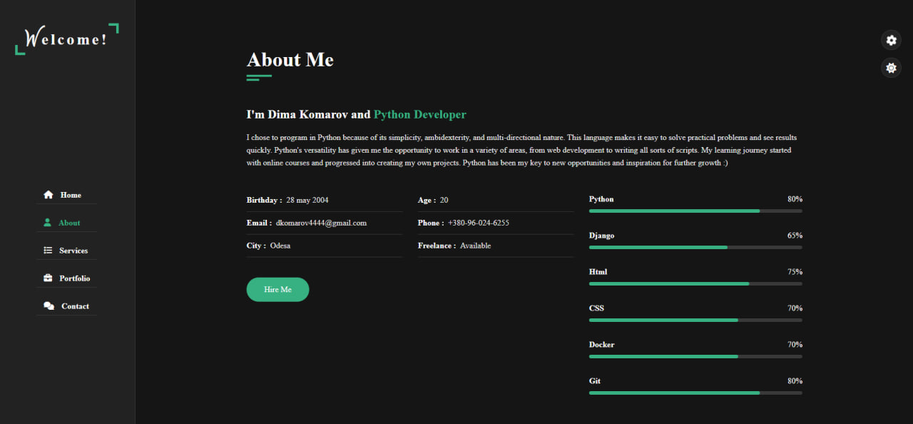
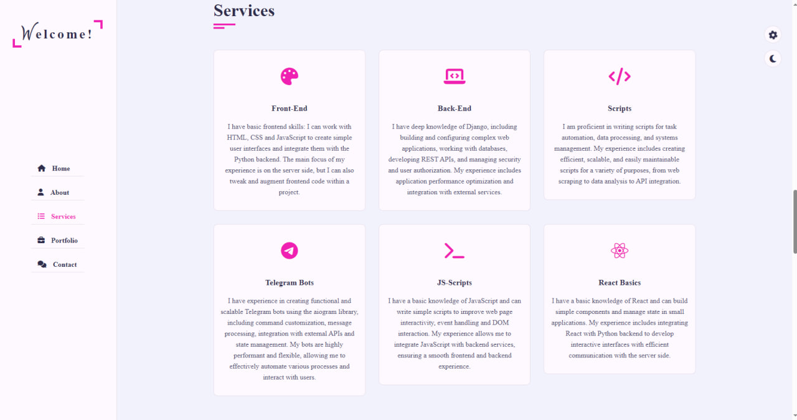
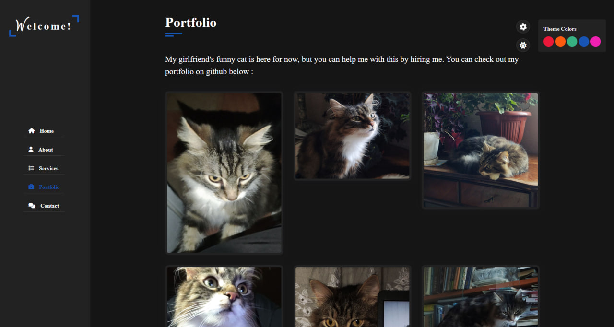
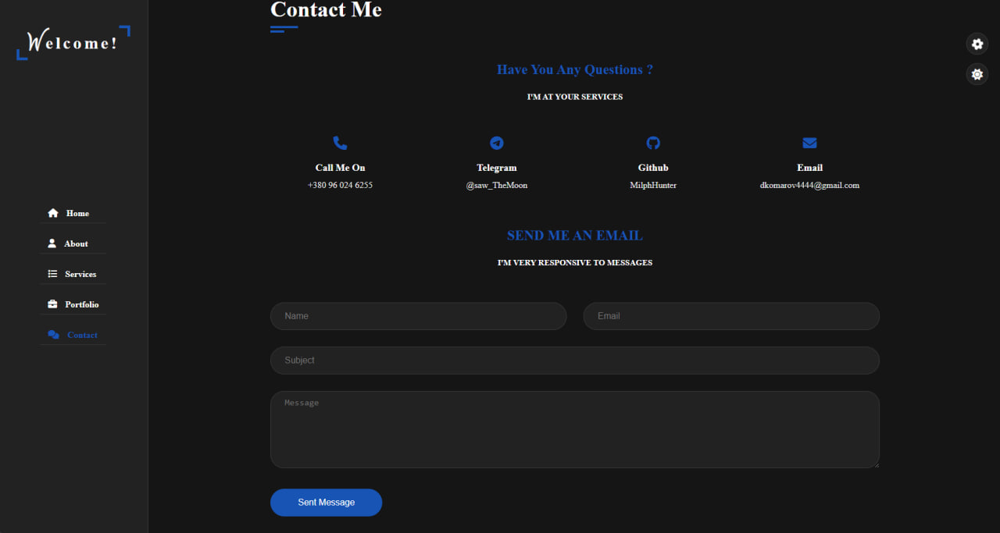

# Portfolio Web-Site using Python Django and HTML/CSS/JS

**This is a simple, one-page portfolio web-site I created for personal use)**

Available pages:

- Home
- About
- Services
- Portfolio
- Contact

## Home

**Page, for the presentation of you. Contains name and other basic, brief information**

## About Orange White and About Green Black

**A page that provides complete information about your training, work experience, approximate knowledge of certain
technologies. Since the site has support for changing the theme (light/dark) and color style of some elements, with
saving their position using cookies and ajax, it was decided to make 2 screenshots using different design, depending on
the possible preferences of the user.**

## Services

**A page presenting the services you can provide.**

## Portfolio

**A page where you can show screenshots of your previous work (a cat instead, since I was too lazy to take screenshots
of the apps I created earlier). In addition, on the right side you can notice a panel for controlling the color scheme
of the site.**

## Contact

**This page contains basic information on how to contact the user. Such as their phone number or social media pages. In
addition, there is a form below to send them an email, which will help them get in touch if they live in different
countries or do not use the same messenger.**

## Feedback

Please use [telegram](https://t.me/saw_TheMoon) for questions or comments.
